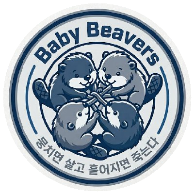
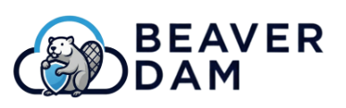
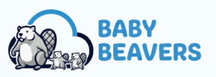

<div align="center">
  <br />
  
  <br />
  <h1>기업 성장에 따른 규모별 안전한 인프라 설계 및 IaC 배포</h1>
  <h3>바이브 코딩부터 1,000만 유저까지</h3>
  <div>
        
       
    
  </div>
  <br />
</div>

## 목차

1. [프로젝트 소개](#1)
2. [주제 선정 배경](#2)
3. [규모별 선택 가이드](#3)
4. [프로젝트 구조](#4)
5. [아키텍처 상세 문서](#5)
6. [팀 소개](#6)

<br />

<div id="1"></div>

## 👋 1. 프로젝트 소개

- 바이브코딩으로 만든 1인 서비스부터 1,000만 유저 규모의 플랫폼까지, 기업이 성장하는 단계마다 인프라 보안 요구사항이 달라집니다.
- 이 레포지토리는 **각 성장 단계에 맞는 AWS 보안 아키텍처**를 설계하고, Terraform으로 바로 배포할 수 있도록 IaC로 구현하였습니다.
- 단순히 이렇게 만들었다에서 끝나지 않고, 우리가 **왜 이 서비스를 선택했는지**, **어떤 위협을 감수했는지**까지 함께 문서화하여 모든 분들이 확인하실 수 있습니다.

<br />

<div id="2"></div>

## ☑️ 2. 주제 선정 배경

TEAM 뭉살흩죽의 Secure Cloud Architecture는 다음과 같은 목표로 제작되었습니다.

| | 목표 |
|--|------|
| 01 | **단계별 아키텍처 학습** — 기업이 성장할 때 필요한 보안 요소를 규모별로 정리 |
| 02 | **바로 쓸 수 있는 산출물** — 설계에서 끝나지 않고 Terraform으로 실제 배포 가능 |
| 03 | **설계 근거 공유** — 왜 이 서비스를 선택했는지, 어떤 위협을 감수했는지까지 문서화 |

규모 별로 안전한 인프라 아키텍처를 구현해보면서, 작은 규모의 아키텍처는 실제로 사용하고 피드백 주실 수 있게끔 만들었습니다. 

<br />

<div id="3"></div>

## 🏴󠁧󠁢󠁥󠁮󠁧󠁿 3. 규모별 선택 기준

| 규모 | 임직원 수 | 사용자 수 | 벤치마킹 기업 |
|------|--------|--------|------------ |
| [바이브코딩](./01-scale-hobby/) | 1명 | ~50명 | 1인 기업 |
| [소규모](./02-scale-startup/) | ~4명 | 1천~1만명 | 스타트업 |
| [중규모](./03-scale-growth/) | ~100명 | ~100만명 | 인프런, 화해, 클래스101 |
| [중대규모](./04-scale-enterprise/) | ~300명 | ~700만명 | 무신사, 티빙, 마켓컬리 | 
| [대규모](./05-scale-hyperscale/) | ~2,000명 | ~1,000만명 | 배달의 민족 |

각각의 세부적인 아키텍처 요소와 구현 내용은 각 규모별 디렉토리에서 확인하실 수 있습니다.
> 바이브코딩, 소규모는 `.tfvars` 작성 및 `terraform apply` 한 번으로 배포할 수 있도록 구성했습니다.
> 중규모 이상은 실제 운영 환경을 고려한 참고용 아키텍처입니다.

<br />

<div id="4"></div>

## 📁 4. 프로젝트 구조

```
📦 repo
├──  /01-scale-hobby/            # 바이브코딩 (~50명) 
├──  /02-scale-startup/          # 소규모 (1천~1만명)
├──  /03-scale-growth/           # 중규모 (~100만명)
├──  /04-scale-enterprise/       # 중대규모 (~700만명)
├──  /05-scale-hyperscale/       # 대규모 (~1,000만명)
└──  /doc/                       # README Assets
```

<br/>
<div id="5"></div>

## 📃 5. 아키텍처 상세 문서

각 규모별 아키텍처 설명, 위협 시나리오, 설계 결정 이유는 GitHub Pages에서 확인할 수 있습니다.

> **[뭉살흩죽 Docs](https://unitelivedispersedie.github.io/secure-cloud-architecture-docs/)**

<br/>
<div id="6"></div>

## 👥 6. TEAM 뭉살흩죽 소개 

<table>
  <tr>
    <td align="center" width="100px">
      <a href="https://github.com/Minsu00326">
        
      </a>
    </td>
    <td align="center" width="100px">
      <a href="https://github.com/jihyangleee">
        
      </a>
    </td>
    <td align="center" width="100px">
      <a href="https://github.com/lhywk">
        
      </a>
    </td>
    <td align="center" width="100px">
      <a href="https://github.com/hvvup">
        
      </a>
    </td>
    <td rowspan="3" width="20px"></td>
    <td rowspan="3" align="center" width="140px">
      <br/>
      <b>Mentor</b><br/>
      <a href="https://www.linkedin.com/in/sjhk/">홍성진</a>
      <br/><br/><br/>
      <b>Project Leader</b><br/>박민서
      <br/>
    </td>
  </tr>
  <tr>
    <td align="center"><a href="https://github.com/Minsu00326">김민수</a></td>
    <td align="center"><a href="https://github.com/jihyangleee">이지향</a></td>
    <td align="center"><a href="https://github.com/lhywk">이호영</a></td>
    <td align="center"><a href="https://github.com/hvvup">조휘정</a></td>
  </tr>
  <tr>
    <td align="center">Member</td>
    <td align="center">Member</td>
    <td align="center">Member</td>
    <td align="center">Project Manager</td>
  </tr>
</table>

<br/>

|  |  |
|:---:|:---:|
| [교육 제공](https://beaver-dam.net/kr) | [프로그램](https://baby.beaver-dam.net/kr) |
| beaver-dam | Babybeavers 1기 |